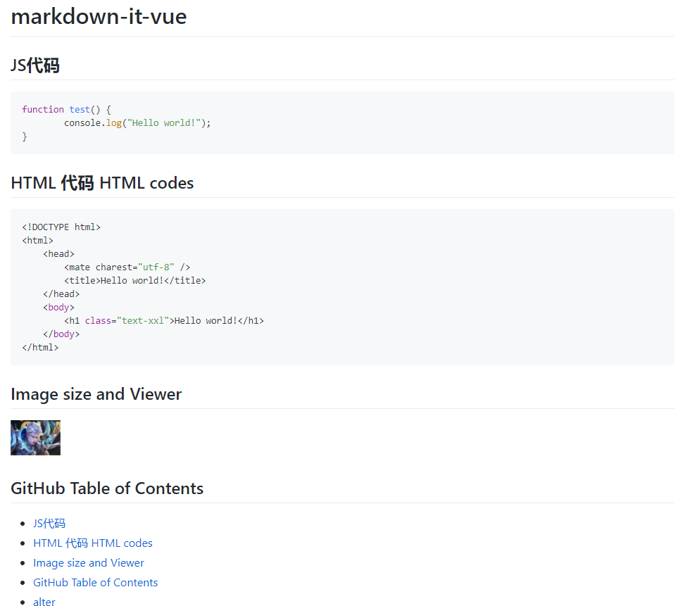

# vue2-markdown-it

[](https://travis-ci.org/zllunpm/vue2-markdown-it)

> The vue lib for markdown-it.

## Demo



## Install

```sh
npm install vue2-markdown-it --save
``` 

## Supports

- Image size and Viewer
- Official markdown syntax.
- GFM TOC
- GFM style
- emoji
- [mermaid charts](http://knsv.github.io/mermaid/)
- [Echarts](http://echarts.baidu.com) **simple only**
- Flowcharts.js
- Subscript/Superscript
- [AsciiMath](http://asciimath.org/)
- info | error | warning message tip

## Plugin list

- markdown-it
- markdown-it-emoji
- markdown-it-sub
- markdown-it-sup
- markdown-it-footnote
- markdown-it-deflist
- markdown-it-abbr
- markdown-it-ins
- markdown-it-mark
- markdown-it-katex
- markdown-it-task-lists
- markdown-it-highlight
- markdown-it-latex
- markdown-it-container
- markdown-it-github-toc
- markdown-it-source-map
- markdown-it-link-attributes

internal plugin list:

- markdown-it-image
- markdown-it-font-awsome
- markdown-it-link-attributes
- markdown-it-highlight
- markdown-it-plugin-echarts
- markdown-it-plugin-mermaid
- markdown-it-plugin-flowchart

## Options

use `options` property to sepcial the options of markdow-it and markdown-it-plugins.

```html
<Vue2MarkdownIt class="md-body" :content="content" :options="options" />
```

```js
options: {
  markdownIt: {
    linkify: true
  },
  linkAttributes: {
    attrs: {
      target: '_blank',
      rel: 'noopener'
    }
  }
}
```

more markdown-it options see <https://markdown-it.github.io/markdown-it/>.

amd default plugins options:

```json
{
  linkAttributes: {
    attrs: {
      target: '_blank',
      rel: 'noopener'
    }
  },
  katex: {
    throwOnError: false,
    errorColor: '#cc0000'
  },
  icons: 'font-awesome',
  githubToc: {
    tocFirstLevel: 2,
    tocLastLevel: 3,
    tocClassName: 'toc',
    anchorLinkSymbol: '',
    anchorLinkSpace: false,
    anchorClassName: 'anchor',
    anchorLinkSymbolClassName: 'octicon octicon-link'
  },
  mermaid: {
    theme: 'default'
  },
  image: {
    hAlign: 'left',
    viewer: true
  }
}
```
## support hilight lang

PR for you lang wich you want.

- html
- json
- css
- shell
- bash
- C
- Java
- Python
- C++
- C#
- PHP
- SQL
- R
- Swift
- Go
- MATLAB
- Ruby
- Perl
- Objective-C
- Rust
- Dart
- Delphi
- D
- Kotlin
- Scala
- SAS
- Lisp
- Lua
- Ada
- Fortran
- PowerShell
- VBScript
- VBscript-html
- Groovy
- Julia
- Julia-repl
- LabVIEW
- Haskell
- ActionScript
- Scheme
- TypeScript
- F#
- Prolog
- Erlang
 
## about echarts

use echarts.simple to reduce the bundle size.

## vue2-markdown-it-light

vue2-markdown-it-light remove the mermaid chart to reduce the bundle size.

<https://github.com/zllunpm/vue2-markdown-it/issues/24>

for a small bundle size, it better to import the vue2-markdown-it-light.

## Usage

```vue
<template>
  <div>
    <Vue2MarkdownIt class="md-body" :content="content" />
  </div>
</template>

<script>
import { Vue2MarkdownIt } from 'vue2-markdown-it'
export default {
  components: {
    Vue2MarkdownIt
  },
  data() {
    return {
      content: '# your markdown content'
    }
  }
}
</script>
```

the light model.

```vue
<template>
  <div>
    <Vue2MarkdownItLight class="md-body" :content="content" />
  </div>
</template>

<script>
import { Vue2MarkdownItLight } from 'vue2-markdown-it'
export default {
  components: {
    Vue2MarkdownItLight
  },
  data() {
    return {
      content: '# your markdown content'
    }
  }
}
</script>
```
 